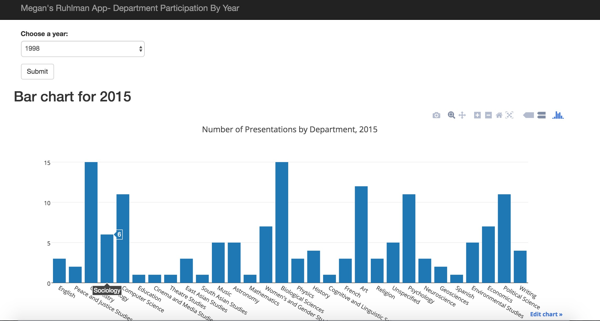

### Ruhlman Project Submission
Megan O'Keefe, 5/3/16

**PROJECT COMPONENTS:**

1. I cleaned the year 2012. see [https://docs.google.com/spreadsheets/d/1OpNjOnUQ1CROihVCadLcHwsHIcp0h9m1ehKFTswm7XM/edit](http://)
I also wrote the first parser to clean up all the Word documents using the docx module (although MR wrote the more extensive one), and wrote code to clean up the abstracts, so that I could make the wordclouds. All that code is in the part 1 folder.

2. Categorical data: I made wordclouds and some other charts (like department representation over the years). See the part 2 folder for notebooks and charts.

3. I did some preliminary clustering using what we learned in NLP and based on the tutorial- see "cleancluster.py" and
also the Topic Modeling notebook in the "categorical" folder. I also did exploratory things with Gephi and word co-occurence. I don't have time to finish creating the network, but the most current version is at [http://cs.wellesley.edu/~mokeefe2/cs249/network3/](http://) (shows labels). My code and Gephi file are in the "networks" folder.

4. I made a simple Flask app, to plot dept. representation by year. See the part 4 folder. A screenshot of the app in action:

